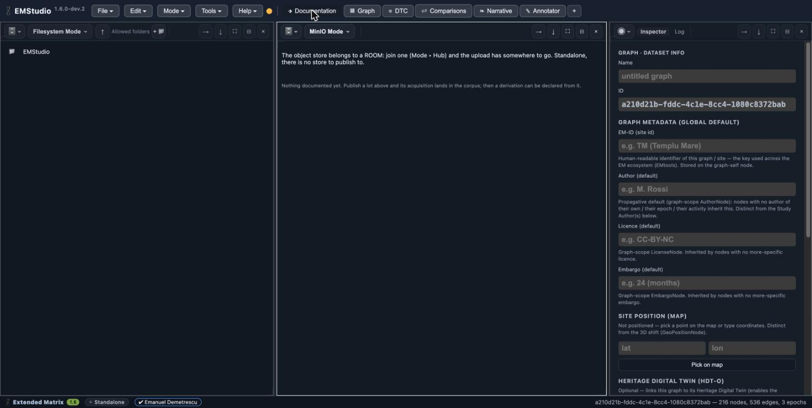

Bring material in
=================

*Goal: get files — sources, images, 3D — into reach of your study.* This happens in
the **Documentation** tab.

Browse the disk
---------------

The **Storage** window in *Filesystem* mode shows the folders you are allowed to
reach (the fence keeps EMStudio to the places you chose). Click a folder to enter
it, the ``↑`` button to go up; entering a root shows the list of roots rather than
"nothing". The browser lists every file on disk — you decide which ones matter.

Put material into a study
-------------------------

A file becomes part of your study when something in the graph *points at it*:

- drag a file onto the **Shelf** (in the Comparisons tab) to keep it as a
  comparandum, or
- attach it to a node as its resource (a Document or a Representation Model),
  which records a ``ResourceNode`` that points at the bytes — it never carries
  them.

Ingest a batch into the object store (in a room)
------------------------------------------------

The second **Storage** window, in *object store* mode, is the room's shared store.
In Standalone there is nothing to publish to, so it says so. Inside a **room**
(``Mode ▸ Hub``), uploading a batch of files does two things at once: the bytes go
to the store addressed by their ``sha256``, and the moment of upload is also when
the material's **provenance** is declared — the acquisition that brought it in.
What lands there appears in the **DTC** tab as the documentation corpus.

.. seealso::

   Disk vs store, in one line: the disk is where files *live on your machine*; the
   object store is where they *become shared, content-addressed assets* the whole
   room can point at. See :doc:`declare-provenance` for what happens to them next,
   and :doc:`collaborate-in-a-room` for what a room is.
