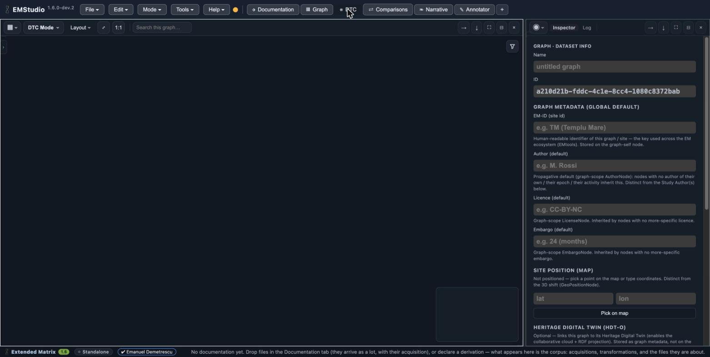

Declare provenance (DTC)
========================

*Goal: record where every asset came from and how it was made.* This is the **DTC**
tab — the documentation corpus shown as a directed graph in the graph window's *DTC
mode*, beside the inspector.

The three acts
--------------

Provenance in EMStudio is built from three kinds of act, which read left to right:

- **Acquisition** — a batch of material entered the study (files dropped in the
  Documentation tab arrive *with* their acquisition);
- **Derivation** — something was made *from* other material (a 3D model derived from
  photographs, a drawing from a scan);
- **Attribution** — who says what about an asset: its author, licence, embargo.

Declare a derivation
--------------------

From a piece of documentation already in the corpus, declare a derivation to record
what was produced from it and with which tool. The result is a node in the corpus
that points back at its inputs — the corpus is a forest whose leaves can be shared
between chains.

Attribution is an act, and the attributor is not the author
-----------------------------------------------------------

Attributing an asset (its author, licence, embargo) is itself a recorded act,
signed by *you* (the **attributor**) at the moment you do it — distinct from the
**author**, who made the thing and may be absent, historical, or unknown. Each
field is three-state: absent, a value, or explicitly withdrawn. This is what lets
the record say "attributed by X on date Y" without pretending X is the author.

.. note::

   Rights declared here **bite**: an asset under embargo is refused (with the date)
   to anyone below editor, and its licence travels with it. Provenance is not
   decoration — it governs who may read what. See
   :doc:`collaborate-in-a-room` for how roles apply.
