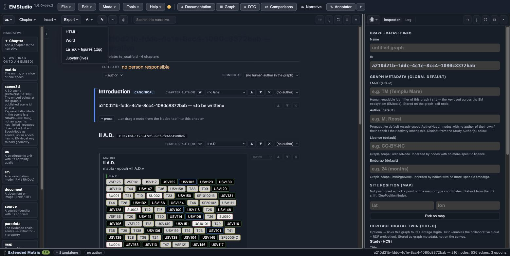

Export the narrative
====================

*Goal: get the story out as a document you can share or publish.* From the
**Narrative** tab, the **Export** menu offers four formats, each a snapshot of the
narrative at the moment you export:

- **HTML** — a single self-contained page (figures inline);
- **Word** (``.docx``) — a document with the figures embedded as images;
- **LaTeX** — a ``.zip`` containing a complete, compilable ``main.tex`` and a
  ``fig/`` folder (LaTeX cannot embed its figures in one file);
- **Jupyter** (``.ipynb``) — a live notebook where the embeds become query cells.

Figures travel with the document
--------------------------------

The visual embeds — the matrix, and where available the map and timeline — are
rendered and carried into the export: the PDF you compile from the LaTeX zip, the
Word document and the HTML page all contain the diagrams, not just their captions.
The map is exported as its vector layer (marker, oriented footprint, north arrow,
coordinates), without the basemap tiles.

.. note::

   In the desktop application the exporters work out of the box. When you run the
   development build, the local bridge needs a couple of Python packages for Word
   and for figure conversion; if they are missing, Word may be unavailable and
   figures fall back to placeholders — the export still happens, and the message
   tells you what to install.

The published reader
--------------------

Beyond these downloads, a **narrative reader** page is served for dissemination —
the same embeds, live, for viewers who do not run EMStudio. That is the
publication side; the exports above are the documents you carry away.
