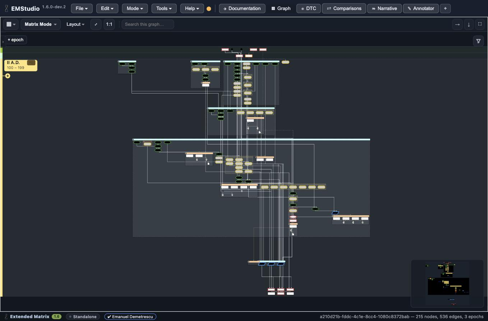
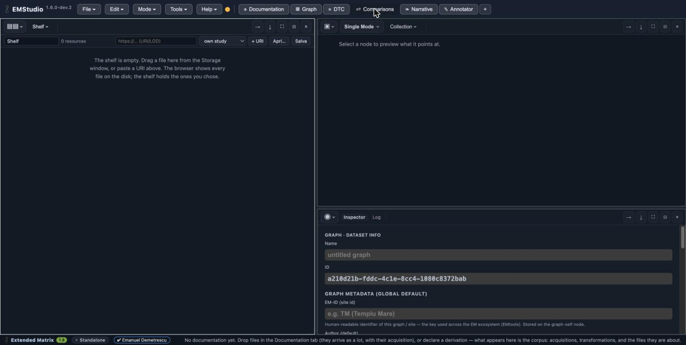
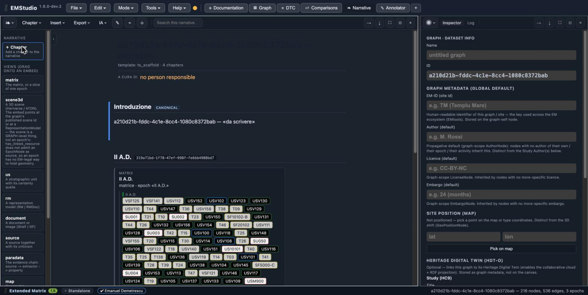
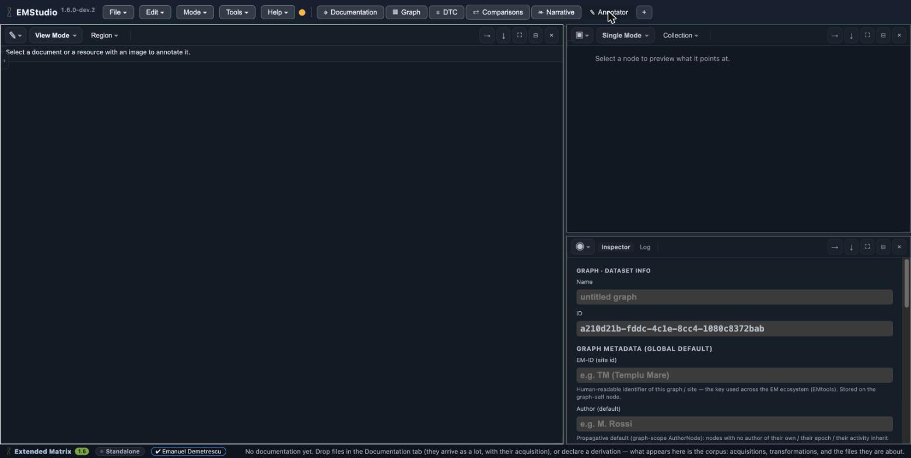

.. _interface:

The interface: six tabs
=======================

The top of the EMStudio window is a row of six tabs — **Documentation · Graph ·
DTC · Comparisons · Narrative · Annotator** — followed by a ``+``. Each tab is an
**arrangement**: a named layout of windows for a kind of work, in the spirit of a
Blender workspace. They are all the same kind of thing (there is no divider and no
"views" section): switching tab re-lays the windows for that task. The ``+`` opens
a new, custom arrangement.

Every window inside an arrangement keeps a **type selector** at the top-left of its
toolbar: you can turn any window into a Graph, Narrative, Table, EMtree, Inspector,
Doc, Viewer, Storage, Annotator or Shelf. The arrangements below are the defaults;
you are free to recompose them.

.. note::

   The screenshots on this page use the **Templu Mare** case study (215 nodes, 536
   edges, 3 epochs), an open dataset shared across Extended Matrix courses and
   demos.

Documentation
-------------

Where material comes in. The default arrangement is a **Storage** window in
Filesystem mode (the disk, fenced to allowed folders), a second **Storage** window
in MinIO mode (the room's object store), and the **Inspector**.

.. image:: ../_static/interface/01_documentation.jpg
   :width: 100%
   :alt: The Documentation tab — filesystem Storage, MinIO Storage, and the Inspector

The object store belongs to a *room*: in Standalone there is nothing to publish to,
so it explains itself rather than showing an empty box.

Graph
-----

The cockpit of interpretation. The default arrangement is the **Graph** window
(Matrix Mode by default, with Graph and DTC as further modes of the same window), a
**Table** below it, and the panels **EMtree** (Multigraph / Outliner) and
**Inspector** (Inspector / Log) to the side.

The matrix is laid out automatically by an epoch-driven engine; groups fold into a
readable diagram, and a minimap tracks where you are in a large graph.

DTC
---

Provenance. The **Graph** window in **DTC mode** shows the documentation corpus as a
directed graph — acquisitions, derivations and attributions — beside the
**Inspector**.

.. image:: ../_static/interface/03_dtc.jpg
   :width: 100%
   :alt: The DTC tab — the documentation/provenance corpus in DTC mode, and the Inspector

Empty here means no documentation yet: files dropped in the Documentation tab arrive
as a batch with their acquisition, and a derivation can be declared from there.

Comparisons
-----------

What is not yours. The **Shelf** (the curated list of comparanda — your own study,
your own Heritage Digital Twin, other Heritage Digital Twins), a **Viewer** to
preview a selected resource, and the **Inspector**.

The shelf is a saved list you build, not a computed view of a folder: drag files in
from a Storage window, or paste a URI.

Narrative
---------

Telling the story. The **Narrative** window — the graph read as prose, with a
palette to add chapters and to drag *views* onto an embed — beside a **Viewer**. The
narrative auto-scaffolds from the epochs (here, a chapter per epoch of Templu Mare,
each with a live matrix embed of its units), and the toolbar carries **Chapter ·
Insert · Export · IA** for authoring, AI-assisted drafts, and export to HTML, Word,
LaTeX and Jupyter.

Embeds are *references*, not copies: the matrix of an epoch shown here stays in sync
with the graph.

Annotator
---------

Annotating images. The **Annotator** window (an image and the regions traced on it),
a **Viewer**, and the **Inspector**.

Select a document or a resource that points at an image to annotate it; its modes
control what the pointer does (look, trace, mask).
